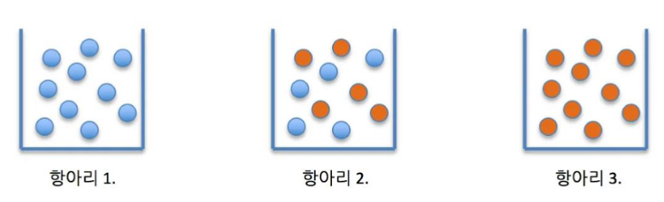
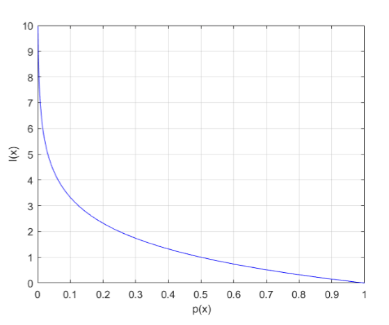
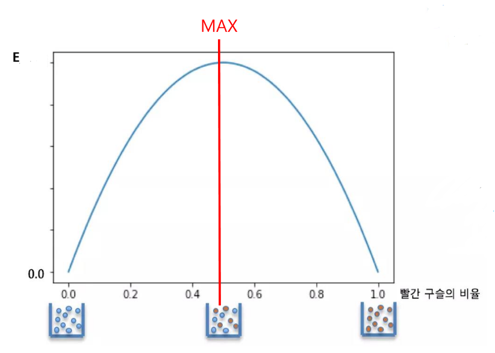
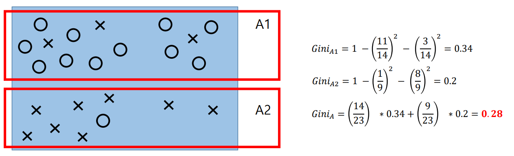
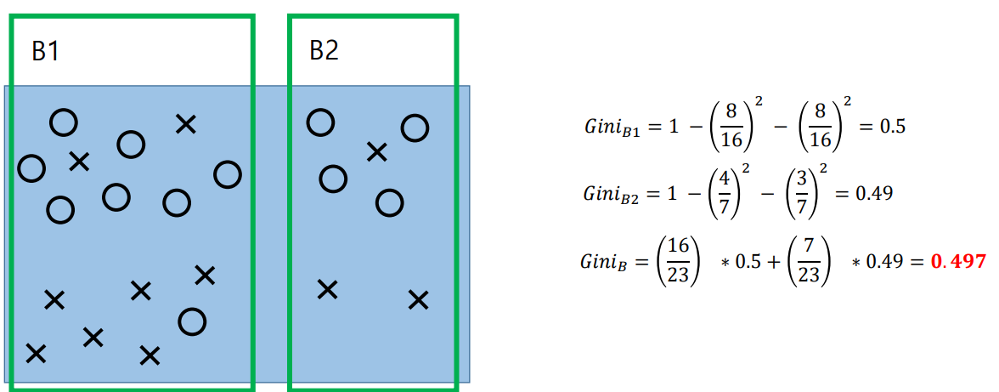

# 의사결정 나무

## 1. 알고리즘
* CART - 가장 널리 사용, 이진 분리, 지니 지수
* ID3, C4.5/C5.0 - 다자분리가능, 엔트로피 지수

### 1.1 Entopy(엔트로피)
* 엔트로피는 해당 Tree를 나누는 기준(불순도를 측정하는 지표)

    * ID3 - Entropy로 계산한 알고리즘
    * CART - Gini계수로 계산한 알고리즘

       
**※항아리 1, 3 은 순도 100% 항아리2는 불순도가 높음**
    
## 2. ID3알고리즘

S - 이미 발생한 사건의 모음   
C - 사건의 갯수   
$$Entropy(S) = \sum\limits_{i=1}^C p_i I(X_i)$$

I(x) - 어떤 사건이 가지고 있는 정보의 양   
p(x) - 사건x가 발생할 확률   
$$I(x) = log_2 \frac{1}{p(x)} $$

### 2.1 정보 확률 그래프
       
**※사건 x가 발생할 확률이 증가할 수록 정보량은 0에 수렴, 자주 발생하는 사건일수록 많은 정보를 가지고 있지 않음**
### 2.2 엔트로피 그래프
       
**※순도100%면 Entropy는 0, 두 공이 섞여 있을 때 Enrtopy가 최대값을 가짐 // 불순한 상태일 수록 Entropy 큰값, 불순도 클 수록 분류하기 어려움**

## 3. CART 알고리즘

* 분류와 회귀가 가능
* 지니를 사용해 불순도 계산
* 불순도가 적은것으로 분할 하는것이 좋음
* 모든 클래스와 비교하여 낮은 불순도를 채택   

### 3.1 지니 불순도
     
     

